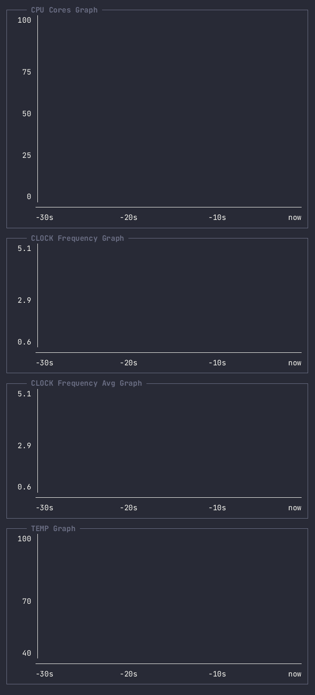
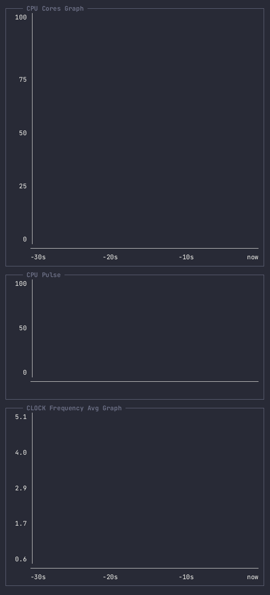
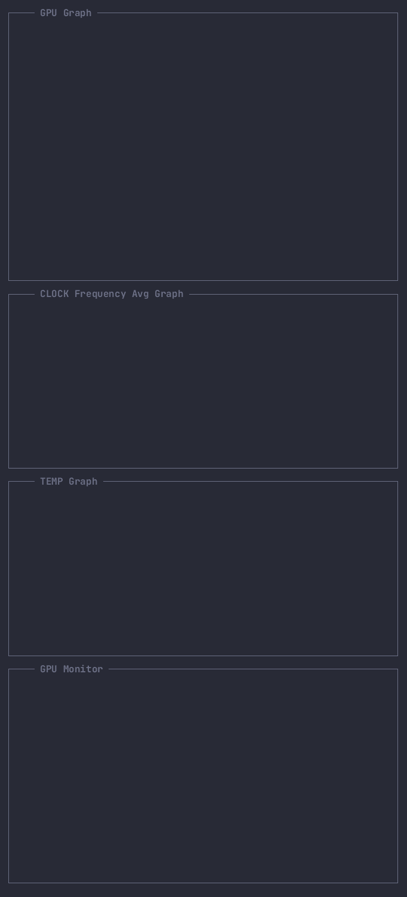
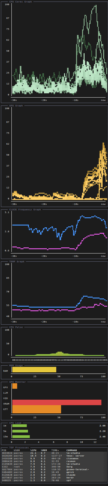
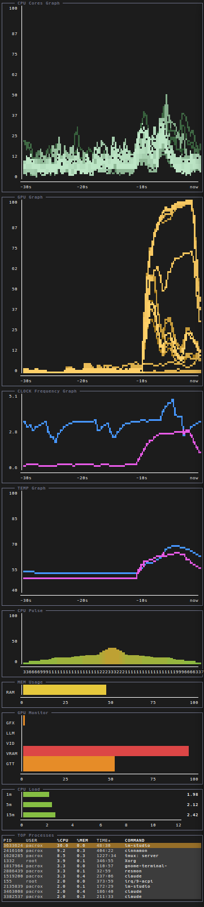
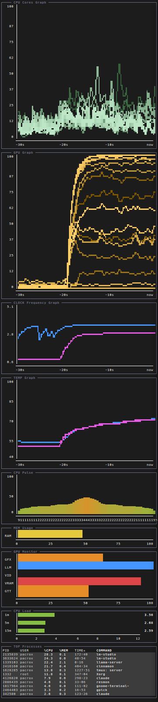
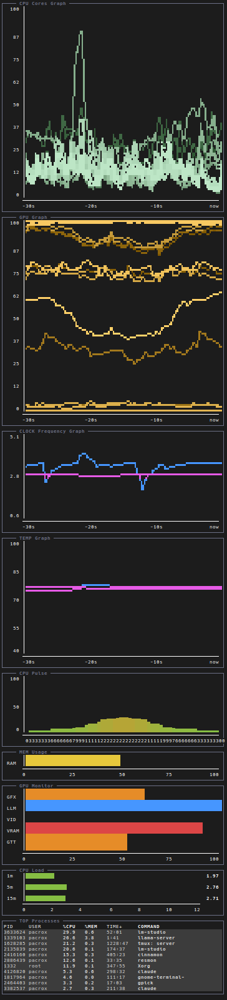
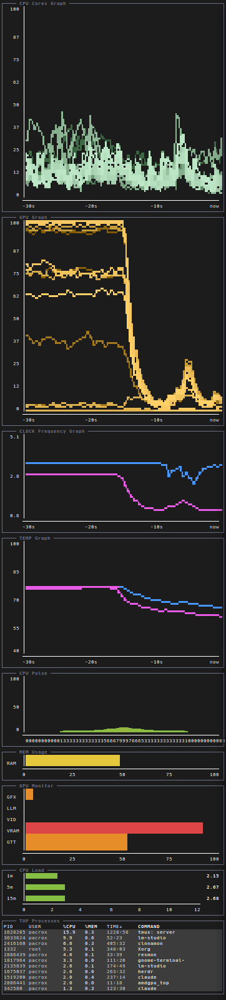

# resmon (v0.3.0)

Zero-dependency TUI resource monitor, written in LuaJIT and compiled into a
single self-contained ELF binary. No external Lua/LuaJIT install is required
at runtime — LuaJIT is linked in statically.

<table>
<tr>
<td></td>
<td></td>
<td></td>
</tr>
</table>

## Features

- Low-CPU, fixed-tick main loop; data is fetched once per source and shared
  by every module that depends on it, regardless of how many modules do.
- 24-bit truecolor rendering (box-drawing frames, block/sextant bars and graphs).
- Configurable layout: vertical or horizontal split, proportional or fixed-size
  panes (`weight`), driven by a plain Lua config file.
- Custom fetchers and modules are loaded as plain-text `.lua` files at
  startup (no recompilation needed) — the same contract used by the built-in
  fetchers and modules.

### Built-in modules

- `cpu` — load average (1/5/15).
- `mem` — RAM usage.
- `top` — process list, row count auto-fit to the pane height.

### Fetchers

Data collection is split from rendering: each fetcher reads one data source
on its own refresh interval and caches the result; any number of modules can
read from the same fetcher without it being re-fetched. A fetcher unused by
any configured module is never loaded.

Fetchers whose data source is vendor-specific carry an `_AMD` or `_INTEL`
suffix. A module doesn't care which fetcher backs it, only that it returns
data shaped the way the module expects (see each module's source) — a
vendor's equivalent fetcher is a drop-in replacement in `fetcher = {...}`,
no module changes needed. **The example configs in `config/` are written
for AMD hardware (integrated GPU included)**; to target an Intel iGPU
system instead, it's enough to replace the `_AMD` suffix with `_INTEL` on
`GPU_Clock`, `CPU_Temp`, `GPU_Temp` and `GPU_Top` throughout your config
file, both in the `fetchers` list and in the `fetcher = {...}` array of
whichever modules reference them.

**The `_INTEL` fetchers are untested** — no Intel hardware was available to
verify them against, so they're released without any guarantee they work
correctly. They were written from documented sysfs paths / driver names
(`coretemp`, i915's `gt_*_freq_mhz`, `intel_gpu_top -J`), not validated on
real hardware. `GPU_Top_INTEL` in particular synthesizes its own JSON
shape from `intel_gpu_top`'s output to stay a true drop-in for
`mod_gpu`/`mod_gpu_graph`, and is the most speculative of the four — see
its own file for exactly what it assumes. If one of these doesn't work on
your system, the dependent module degrades to stale/no data rather than
crashing (same fetcher-error contract as any other fetcher) — reports of
what actually works (or doesn't) on real Intel hardware are welcome.

| Fetcher | OS/Arch | Source | Depend. | Notes |
|---|---|---|---|---|
| `CPU_Average` | Linux (any arch) | `/proc/loadavg` | — | Fixed 60s refresh, not overridable |
| `MEM` | Linux (any arch) | `/proc/meminfo` | — | — |
| `TOP` | Linux/x86-64 | `/proc/[pid]/stat`<br>`/proc/[pid]/status`<br>`/etc/passwd` | — | Assumes `CLK_TCK=100` (glibc default) |
| `CPU_Cores` | Linux (any arch) | `/proc/stat` | — | Core count auto-detected |
| `CPU_Clock` | Linux (any arch) | `cpuN/cpufreq/*` (per-core) | — | Min/max range discovered once at load |
| `GPU_Clock_AMD` | Linux/AMD | hwmon `amdgpu` sclk + `pp_dpm_sclk` | — | Min/max range discovered once at load |
| `GPU_Clock_INTEL` | Linux/Intel | i915 sysfs `gt_*_freq_mhz` | — | **Untested.** Min/max range discovered once at load |
| `CPU_Temp_AMD` | Linux/AMD | hwmon `k10temp` | — | — |
| `CPU_Temp_INTEL` | Linux/Intel | hwmon `coretemp` | — | **Untested** |
| `GPU_Temp_AMD` | Linux/AMD | hwmon `amdgpu` | — | — |
| `GPU_Temp_INTEL` | Linux/Intel | hwmon `i915` | — | **Untested**, likely absent on most systems — integrated Intel GPUs usually have no separate thermal sensor from the CPU package |
| `GPU_Top_AMD` | Linux/AMD | `amdgpu_top -J` | `amdgpu_top` | One persistent process shared by every module that depends on it; first sample after (re)spawn always reads 0; GRBM% reads 0 without perf-counter access |
| `GPU_Top_INTEL` | Linux/Intel | `intel_gpu_top -J` | `intel_gpu_top` | **Untested**, the most speculative of the four Intel fetchers; synthesizes a GFX/Media-only approximation of AMD's fdinfo shape, no GRBM/GRBM2 or VRAM/GTT equivalent |

### Custom modules (`mods/`)

- `mod_cpu_cores` — per-core usage, vertical bars sorted busiest-to-idlest.
- `mod_cpu_cores_graph` — per-core usage, scrolling history graph, all cores overlaid.
- `mod_cpu_pulse` — per-core usage, mirrored bars forming a symmetric pulse
  shape with the busiest core at the center.
- `mod_temp_graph` — CPU/GPU temperature, scrolling history graph.
- `mod_clock_graph` — per-core CPU clock frequency (one blue shade per core)
  plus GPU clock (magenta, always drawn on top), scrolling history graph.
- `mod_clock_avg_graph` — average CPU clock frequency across all cores plus
  GPU clock, scrolling history graph.
- `mod_gpu` — GPU resource usage bars (via `amdgpu_top -J`).
- `mod_gpu_graph` — GPU engine/performance-counter usage, scrolling history graph (via `amdgpu_top -J`).

`mod_gpu` and `mod_gpu_graph` require `GPU_Top_AMD` (`amdgpu_top` on `$PATH`,
AMD GPU) or, untested, `GPU_Top_INTEL` (`intel_gpu_top` on `$PATH`, Intel
iGPU); every other custom module's fetcher reads directly from `/proc` and
`/sys` via FFI.

### Modules → fetcher(s)

The GPU line on `mod_clock_graph`/`mod_clock_avg_graph` is optional: include
`GPU_Clock_AMD` (or, untested, `GPU_Clock_INTEL`) in that module instance's
`fetcher = {...}` list to show it, omit it to draw CPU-only — there is no
separate on/off option, the dependency list itself is the toggle.
`mod_temp_graph` needs both of its fetchers; if they
refresh at different rates, the graph repeats each one's last value between
its own updates.

| Module | Fetcher(s) |
|---|---|
| `cpu` | `CPU_Average` |
| `mem` | `MEM` |
| `top` | `TOP` |
| `mod_cpu_cores` | `CPU_Cores` |
| `mod_cpu_cores_graph` | `CPU_Cores` |
| `mod_cpu_pulse` | `CPU_Cores` |
| `mod_temp_graph` | `CPU_Temp_AMD`, `GPU_Temp_AMD` |
| `mod_clock_graph` | `CPU_Clock` (+ `GPU_Clock_AMD` optional) |
| `mod_clock_avg_graph` | `CPU_Clock` (+ `GPU_Clock_AMD` optional) |
| `mod_gpu` | `GPU_Top_AMD` |
| `mod_gpu_graph` | `GPU_Top_AMD` |

## Screenshots

<table>
<tr>
<td></td>
<td></td>
<td></td>
</tr>
<tr>
<td></td>
<td></td>
<td></td>
</tr>
</table>

## Build

Requirements: `gcc`, `luajit`, and the LuaJIT static library + headers
(`libluajit-5.1-dev` on Debian/Ubuntu).

```sh
sudo apt install libluajit-5.1-dev   # if not already installed
make
```

This produces a single binary, `resmon`, in the project root. glibc/libm/libdl
stay dynamically linked (LuaJIT's FFI needs `dlsym`-style resolution, which
does not work against a fully static glibc), but these are present on every
Linux system, so no separate Lua/LuaJIT install is needed to run it.

`make clean` removes build output (`host.o`, `resmon`, `generated/`).

## Install

```sh
make install-config
```

Copies the custom fetchers from `fetchers/` into `~/.config/resmon/addons/fetchers/`
and the custom modules from `mods/` into `~/.config/resmon/addons/mods/`, and
installs `config/config.lua.example` as `~/.config/resmon/config.lua` if one
doesn't already exist there. Copy `resmon` itself wherever you like on `$PATH`.

## Usage

```sh
./resmon [options]
```

| Option | Description |
|---|---|
| `--config-dir <path>` | Override the default config dir (`~/.config/resmon`) |
| `--config-file <path>` | Override the config file path (default: `<config-dir>/config.lua`) |
| `--fetchers-dir <path>` | Override the fetchers dir (default: `<config-dir>/addons/fetchers`) |
| `--modules-dir <path>` | Override the custom modules dir (default: `<config-dir>/addons/mods`) |
| `-h`, `--help` | Show help and exit |
| `-v`, `--version` | Show version and exit |

Keys: `Q` / `ESC` — quit. `P` — pause/resume data fetching (frame stays drawn).

## Terminal recommendations

resmon's own CPU usage is low, but rendering 24-bit truecolor over a
high-density grid (small font, large window) puts the load on the terminal
emulator instead — the render cost scales with cell count, not with resmon.
GPU-accelerated terminals with a minimal renderer, like `alacritty`, handle
this well at low overhead; heavier ones (e.g. `wezterm`) cost noticeably more
per frame at the same grid size.

## Configuration

`~/.config/resmon/config.lua` returns a Lua table:

```lua
return {
	orientation = "vertical", -- or "horizontal"

	fetchers = {
		{ name = "CPU_Average", refresh = 60 },
		{ name = "MEM", refresh = 1.5 },
		{ name = "CPU_Cores", refresh = 0.33 },
	},

	modules = {
		{ name = "cpu", mod = "cpu", fetcher = { "CPU_Average" } },
		{ name = "mem", mod = "mem", weight = 1, fetcher = { "MEM" } },
		{ name = "cores", mod = "mod_cpu_cores", weight = 2, fetcher = { "CPU_Cores" } },
	},
}
```

`fetchers` — data sources:

- `name`: one of the built-in fetchers (`CPU_Average`, `MEM`, `TOP`), or the
  filename (without `.lua`) of a fetcher in the fetchers dir, e.g. `CPU_Cores`
  for `CPU_Cores.lua`. Must be unique; a duplicate is dropped with a warning.
  A fetcher not referenced by any module below is never loaded.
- `refresh`: fetch interval in seconds. Ignored by fetchers with a fixed
  delay (e.g. `CPU_Average`'s load-average fetcher).

`modules` — what gets drawn:

- `name`: this instance's unique id. Only used to report load errors and to
  match it up internally with its fetcher(s); a duplicate is dropped with a
  warning.
- `mod`: one of the built-in modules (`cpu`, `mem`, `top`), or the filename
  (without `.lua`) of a module in the modules dir, e.g. `mod_cpu_cores` for
  `mod_cpu_cores.lua`. The same `mod` can appear more than once, each time
  with a different `name`/`fetcher`/`weight`.
- `fetcher`: array of fetcher names this module reads from, in order. A
  module needs at least one; one referencing a fetcher that doesn't exist is
  dropped with a warning.
- `weight`: proportional share of terminal space (default `1`, equal split).
  A negative weight is an exact size instead — e.g. `weight = -10` always
  gives that module 10 rows (vertical layout) or columns (horizontal), with
  remaining space split proportionally among the rest.
- any other field is passed through to a custom module as its own config
  entry (received as part of the module's Lua varargs, `...`), so a module
  can define additional options of its own. See each module's source for the
  options it supports.
- `interval`: on every scrolling-history graph module (`mod_cpu_cores_graph`,
  `mod_clock_graph`, `mod_clock_avg_graph`, `mod_temp_graph`, `mod_gpu_graph`),
  the width of the X-axis time window in seconds (default `30`).

See `config/config.lua.example` for a minimal starting point,
`config/config-full.lua.example` for a fuller vertical setup exercising most
modules at once, or `config/config-horiz.lua.example` for the same set of
modules laid out horizontally instead.


## Contributing

Code development contributions are welcome.

## A Note on Licensing and Protest

The author notes that the Federative Republic of Brazil, the State of California,
and the State of Colorado have enacted legislation effectively outlawing free,
non-tracking, and decentralized open-source software by demanding mandatory
operating-system-level identity certification.

In protest, the author has attached a symbolic statement to this Software's
license expressing that they do not wish it to be used within said
territories. This is a symbolic, non-binding statement of protest — it does
not modify, restrict, or condition the permissions granted by the license.
See [LICENSE.txt](LICENSE.txt) and [MANIFESTO.md](MANIFESTO.md) for the full
statement and its motivation.


## License

MIT License (plus a symbolic, non-binding protest statement — see
[LICENSE.txt](LICENSE.txt)).

---

<a href="https://awesometui.com/resmon"></a><br>
<b>resmon - Terminal UI application</b><br>
A zero-dependency TUI resource monitor written in LuaJIT<br>
<a href="https://awesometui.com/resmon"><i>awesometui.com</i></a>

