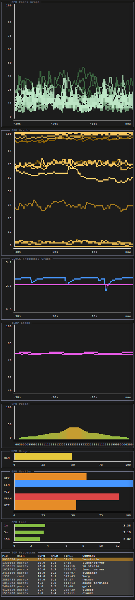

# resmon

Zero-dependency TUI resource monitor, written in LuaJIT and compiled into a
single self-contained ELF binary. No external Lua/LuaJIT install is required
at runtime — LuaJIT is linked in statically.

## Features

- Low-CPU, fixed-tick main loop; per-module refresh rate.
- 24-bit truecolor rendering (box-drawing frames, block/sextant bars and graphs).
- Configurable layout: vertical or horizontal split, proportional or fixed-size
  panes (`weight`), driven by a plain Lua config file.
- Custom modules are loaded as plain-text `.lua` files at startup (no
  recompilation needed) — the same contract used by the three built-in modules.

### Built-in modules

- `cpu` — load average (1/5/15).
- `mem` — RAM usage.
- `top` — process list, row count auto-fit to the pane height.

### Custom modules (`mods/`)

- `mod_cpu_cores` — per-core usage, vertical bars sorted busiest-to-idlest.
- `mod_cpu_cores_graph` — per-core usage, scrolling history graph, all cores overlaid.
- `mod_cpu_pulse` — per-core usage, mirrored bars forming a symmetric pulse
  shape with the busiest core at the center.
- `mod_temp_graph` — CPU/GPU temperature, scrolling history graph.
- `mod_clock_graph` — per-core CPU clock frequency (one blue shade per core)
  plus optional GPU clock (magenta, always drawn on top), scrolling history graph.
- `mod_clock_avg_graph` — average CPU clock frequency across all cores plus
  optional GPU clock, scrolling history graph.
- `mod_gpu` — GPU resource usage bars (via `amdgpu_top -J`).
- `mod_gpu_graph` — GPU engine/performance-counter usage, scrolling history graph (via `amdgpu_top -J`).

`mod_gpu` and `mod_gpu_graph` require the `amdgpu_top` tool on `$PATH` and an
AMD GPU; every other module reads directly from `/proc` and `/sys` via FFI.

### Module compatibility

| Module | OS/Arch | Source | Depend. | Notes |
|---|---|---|---|---|
| `cpu` | Linux (any arch) | `/proc/loadavg` | — | — |
| `mem` | Linux (any arch) | `/proc/meminfo` | — | — |
| `top` | Linux/x86-64 | `/proc/[pid]/stat`<br>`/proc/[pid]/status`<br>`/etc/passwd` | — | Assumes `CLK_TCK=100` (glibc default) |
| `mod_cpu_cores` | Linux (any arch) | `/proc/stat` | — | Core count auto-detected |
| `mod_cpu_cores_graph` | Linux (any arch) | `/proc/stat` | — | Core count auto-detected |
| `mod_cpu_pulse` | Linux (any arch) | `/proc/stat` | — | Core count auto-detected |
| `mod_temp_graph` | Linux/AMD | hwmon `k10temp` (CPU)<br>hwmon `amdgpu` (GPU) | — | Both sides are AMD-only; no Intel `coretemp` fallback (CPU) |
| `mod_clock_graph` | Linux (any arch)<br>+AMD (GPU) | `cpuN/cpufreq/*` (CPU, per-core)<br>hwmon `amdgpu` sclk + `pp_dpm_sclk` (GPU) | — | GPU optional (`show_gpu`, default `true`); GPU side is AMD-only; GPU line always drawn on top of CPU lines |
| `mod_clock_avg_graph` | Linux (any arch)<br>+AMD (GPU) | `cpuN/cpufreq/*` (CPU, averaged)<br>hwmon `amdgpu` sclk + `pp_dpm_sclk` (GPU) | — | GPU optional (`show_gpu`, default `true`); single averaged CPU line instead of per-core |
| `mod_gpu` | Linux/AMD | `amdgpu_top -J` | `amdgpu_top` | GRBM% reads 0 without perf-counter access |
| `mod_gpu_graph` | Linux/AMD | `amdgpu_top -J` | `amdgpu_top` | First sample after (re)spawn always reads 0 |

## Screenshots

<table>
<tr>
<td></td>
<td></td>
<td></td>
</tr>
<tr>
<td></td>
<td></td>
<td></td>
</tr>
</table>

## Build

Requirements: `gcc`, `luajit`, and the LuaJIT static library + headers
(`libluajit-5.1-dev` on Debian/Ubuntu).

```sh
sudo apt install libluajit-5.1-dev   # if not already installed
make
```

This produces a single binary, `resmon`, in the project root. glibc/libm/libdl
stay dynamically linked (LuaJIT's FFI needs `dlsym`-style resolution, which
does not work against a fully static glibc), but these are present on every
Linux system, so no separate Lua/LuaJIT install is needed to run it.

`make clean` removes build output (`host.o`, `resmon`, `generated/`).

## Install

```sh
make install-config
```

Copies the custom modules from `mods/` into `~/.config/resmon/mods/`, and
installs `config/config.lua.example` as `~/.config/resmon/config.lua` if one
doesn't already exist there. Copy `resmon` itself wherever you like on `$PATH`.

## Usage

```sh
./resmon [options]
```

| Option | Description |
|---|---|
| `--config-dir <path>` | Override the default config dir (`~/.config/resmon`) |
| `--config-file <path>` | Override the config file path (default: `<config-dir>/config.lua`) |
| `--modules-dir <path>` | Override the custom modules dir (default: `<config-dir>/mods`) |
| `-h`, `--help` | Show help and exit |
| `-v`, `--version` | Show version and exit |

Keys: `Q` / `ESC` — quit. `P` — pause/resume data fetching (frame stays drawn).

## Configuration

`~/.config/resmon/config.lua` returns a Lua table:

```lua
return {
	orientation = "vertical", -- or "horizontal"

	modules = {
		{ name = "cpu" },
		{ name = "mem", weight = 1 },
		{ name = "mod_cpu_cores", weight = 2 },
		{ name = "top", weight = 3 },
	},
}
```

- `name`: one of the built-in modules (`cpu`, `mem`, `top`), or the filename
  (without `.lua`) of a module in the modules dir, e.g. `mod_cpu_cores` for
  `mod_cpu_cores.lua`.
- `weight`: proportional share of terminal space (default `1`, equal split).
  A negative weight is an exact size instead — e.g. `weight = -10` always
  gives that module 10 rows (vertical layout) or columns (horizontal), with
  remaining space split proportionally among the rest.
- `refresh`: overrides a module's default refresh delay in seconds. Ignored
  by modules with a fixed delay (e.g. `cpu`'s load-average module).
- any other field is passed through to a custom module as its own config
  entry (received as the module's Lua varargs, `...`), so a module can define
  additional options of its own — e.g. `mod_clock_graph`/`mod_clock_avg_graph`
  accept `show_gpu = false` to drop the GPU line. See each module's source
  for the options it supports.

See `config/config.lua.example` for a working starting point.


## Contributing

Code development contributions are welcome.

## A Note on Licensing and Protest

The author notes that the Federative Republic of Brazil, the State of California,
and the State of Colorado have enacted legislation effectively outlawing free,
non-tracking, and decentralized open-source software by demanding mandatory
operating-system-level identity certification.

In protest, the author has attached a symbolic statement to this Software's
license expressing that they do not wish it to be used within said
territories. This is a symbolic, non-binding statement of protest — it does
not modify, restrict, or condition the permissions granted by the license.
See [LICENSE.txt](LICENSE.txt) and [MANIFESTO.md](MANIFESTO.md) for the full
statement and its motivation.


## License

MIT License (plus a symbolic, non-binding protest statement — see
[LICENSE.txt](LICENSE.txt)).

