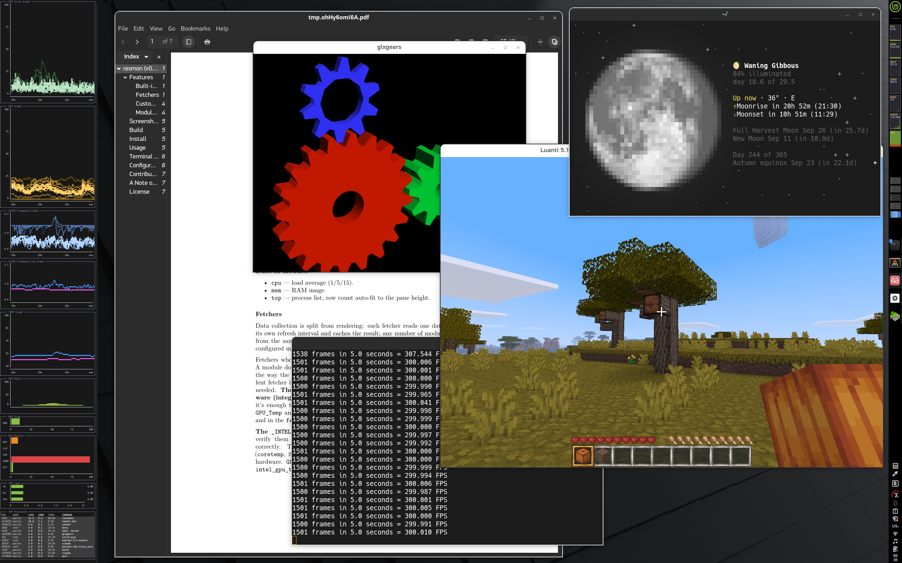
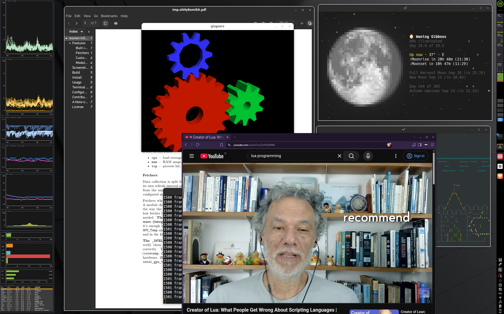
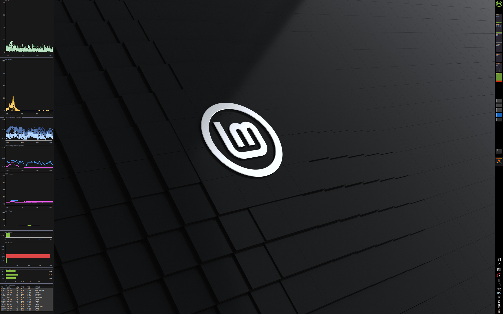
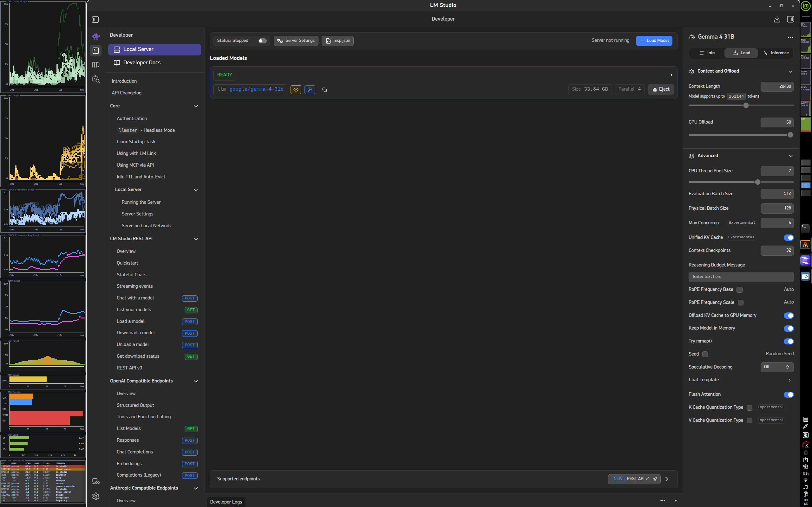

# resmon

A lightweight terminal resource monitor: CPU, RAM, per-core usage, clock
frequency, temperatures and (on AMD/Intel) GPU stats, laid out in whatever
combination of panes you want.

## Install

```sh
./install.sh
```

This copies the `resmon` binary to `~/.local/bin/resmon`, and sets up
`~/.config/resmon/` with the bundled fetchers/modules, a starter
`config.lua`, and two ready-to-copy skeletons plus a walkthrough
(`fetcher_addon_sample.lua`, `module_addon_sample.lua`,
`ADDON-AUTHORING.md`) if you ever want to write your own fetcher or
module. If `~/.local/bin` isn't already on your `$PATH`, the script tells
you what to add to your shell rc file.

Re-running `install.sh` later always refreshes the binary and the bundled
fetchers/modules. What happens to your own `config.lua` depends on what
was there before:

- **No previous install** — a starter `config.lua` is installed.
- **Same version already installed** — `config.lua` is left exactly as
  you have it, untouched.
- **resmon 0.3.0 found on `$PATH`** — the only upgrade automatically
  handled: custom modules dropped the `mod_` filename prefix between
  0.3.0 and 0.4.0, so `config.lua` is backed up to `config.lua.bak`, then
  edited in place to point at the new names, and the old,
  now-superseded module files are deleted. Pass `--upgrade` to skip the
  confirmation prompt (it still lists what will be deleted first).
- **Anything else** (an older or unrecognized version, or `resmon` not
  found on `$PATH` at all) — there's no known rename map for it, so
  `install.sh` only warns that it can't auto-upgrade that version; on
  confirmation, `config.lua` is backed up to `config.lua.bak` and
  replaced with the standard starter `config.lua` — no addon files are
  deleted in this case.

## Run

```sh
resmon
```

Keys: `Q` / `ESC` — quit. `P` — pause/resume data fetching (frame stays drawn).

## Configuring

Your config lives at `~/.config/resmon/config.lua`. The starter file installed
for you is a full-featured layout exercising every bundled module (per-core
usage, clock frequency, temperature and GPU graphs, load average, RAM,
process list) — open it and adjust `orientation`, remove entries you don't
want, or change a `weight` to resize a pane.

The starter config assumes an **AMD** system (CPU + integrated GPU). If your
machine is **Intel** instead, open `config.lua` and change every fetcher name
ending in `_AMD` to `_INTEL` (both in the `fetchers` list and in any module's
`fetcher = {...}` list that references it) — the Intel fetchers are drop-in
replacements, but haven't been verified on real Intel hardware, so treat them
as best-effort.

If a fetcher's data source isn't available on your system (e.g. no matching
temperature sensor, or the underlying tool isn't installed), the modules that
depend on it just show stale/no data instead of crashing resmon.

## Standalone addon CLI

Every fetcher and module can be inspected, sampled, or demoed on its own,
without touching `config.lua`:

```sh
resmon <addon_name> [-i|-h|-s|-d]
```

Handy for checking whether a fetcher actually works on your hardware
before adding it — e.g., since the Intel fetchers above are best-effort:

```sh
resmon GPU_Top_INTEL -i   # info + a VALID/FAULT dependency check
resmon CPU_Clock -s       # one-shot real sample, printed to your terminal
resmon clock_graph -d     # live demo pane (fake data unless you pass -f)
```

`-i`/`--info` shows metadata and a dependency check; `-h`/`--help` shows
the addon's own configurable options; `-s`/`--sample` prints or draws one
static sample; `-d`/`--demo` is a live-updating full-screen demo (`Q`/`ESC`
to quit). Run `resmon <addon_name>` with no mode flag for that addon's own
option summary, or `resmon --list` to see everything installed.

## Terminal recommendations

resmon itself uses little CPU, but rendering 24-bit color over a dense grid
puts the load on your terminal emulator instead. GPU-accelerated terminals
with a minimal renderer (e.g. `alacritty`) handle this comfortably; heavier
ones cost noticeably more per frame at the same window size.

## Uninstall

```sh
rm ~/.local/bin/resmon
rm -rf ~/.config/resmon
```

(Skip the second line if you'd rather keep your `config.lua` around.)

## Desktop screenshots

resmon at a dense, small-font, full-screen density:

```sh
alacritty -o window.dimensions.columns=68 -o window.dimensions.lines=178 -o font.size=5
```

<table>
<tr>
<td></td>
<td></td>
</tr>
<tr>
<td></td>
<td></td>
</tr>
</table>
